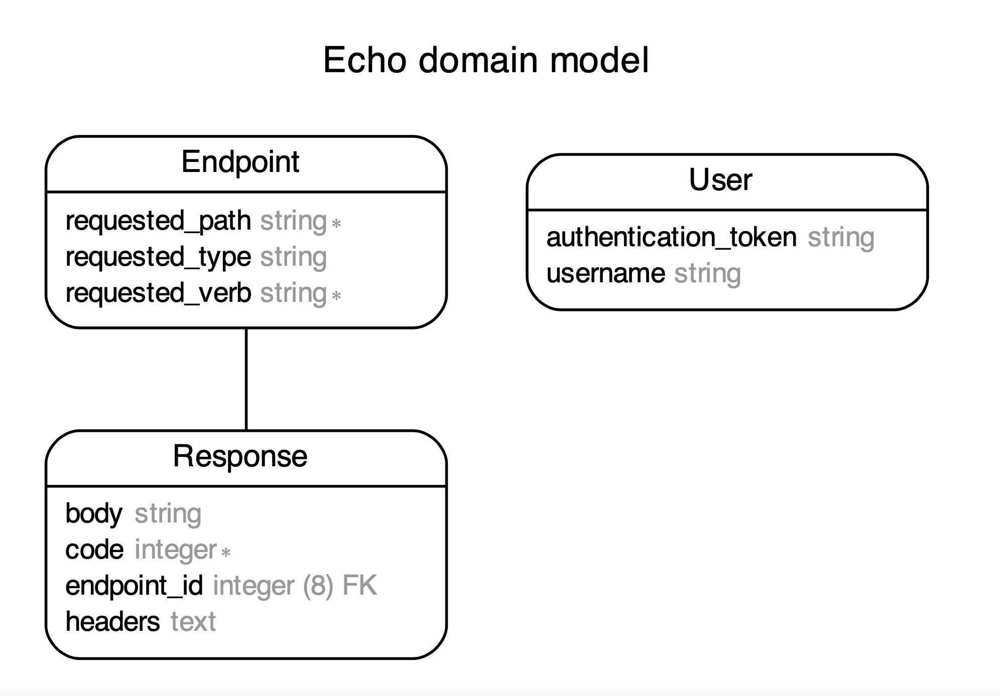
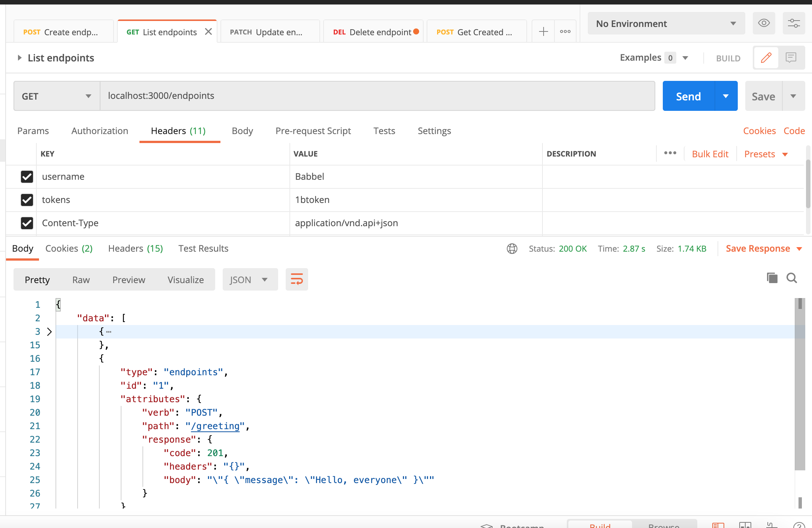
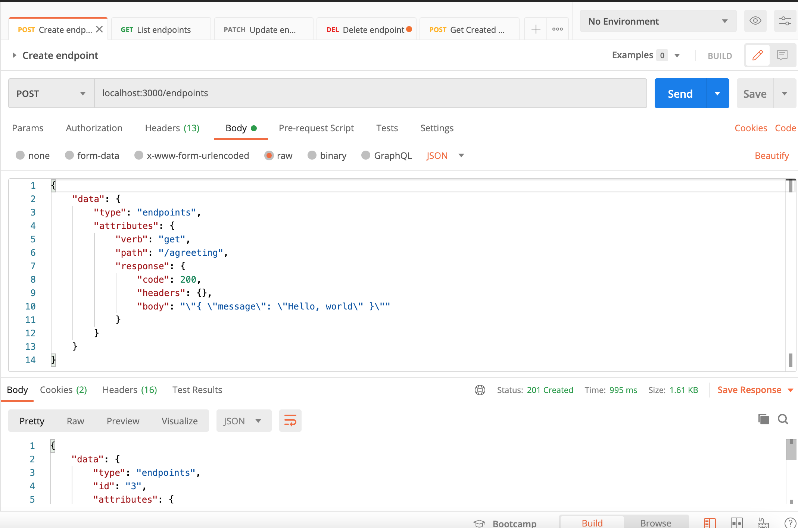
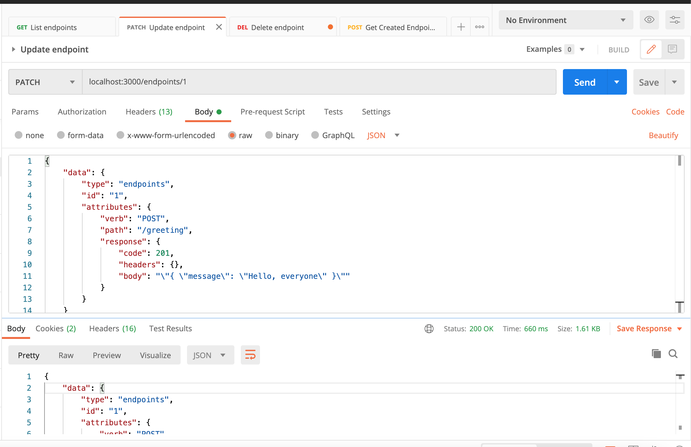
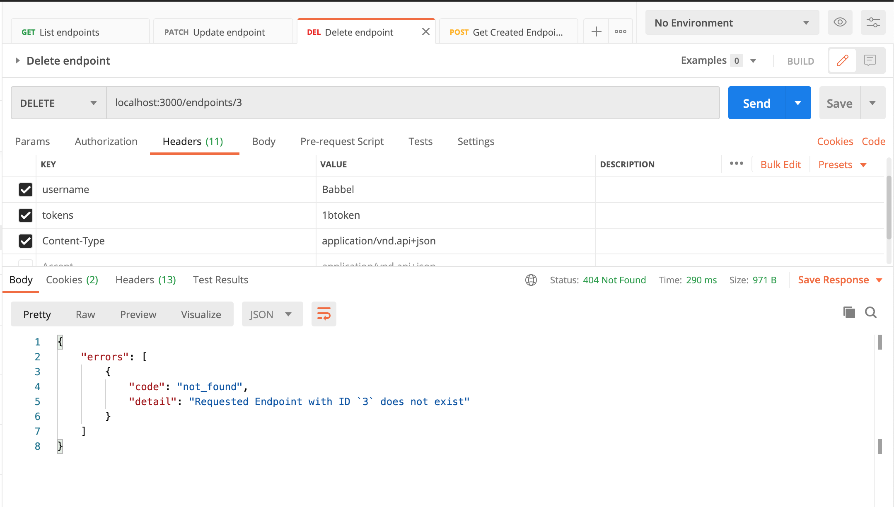
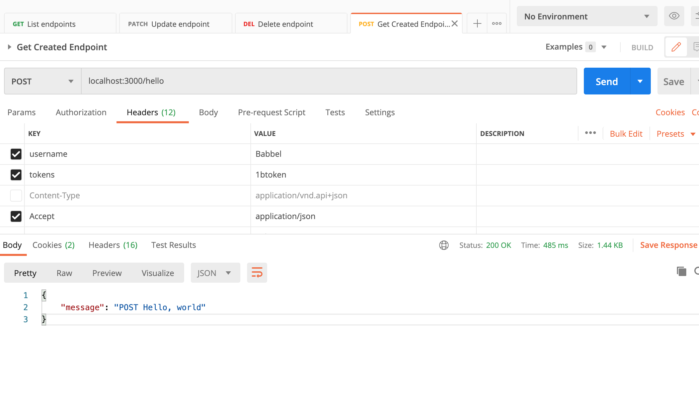
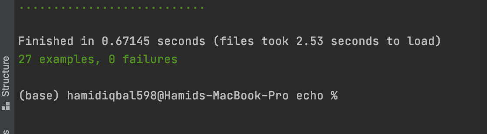

# Babbel Assessment
## Echo - Code challenge for Backend Developer Postion


The aim is to express my level of skills and knowledge as they are required to deal with everyday tasks when working for Babbel.
To achieve this purpose, I completed all tasks while keeping in mind the task definition.

Solution:
* I used Ruby on Rails Framework for Development.
* Ruby (Version: 2.7.1)
    * CMD (bundle install)
* Rails (Version: 6.1.5)
* Database - Postgres
* Api Exposed on API Testing Plateform (eg: POSTMAN)
* Database creation
* Database initialization
    * CMD (rake db:setup)
    * I added initial records in db:seed

* For Test Cases I used (Rspec and Capybara)
* How to run the test suite
    * CMD (bundle exec rspec spec)

* Running instructions:
    * CMD (rails s)
    * View on any API Testing Platform (eg: POSTMAN)
    * Collection Link ( https://www.getpostman.com/collections/000ca496f16531f68737 )

# Run the Rails Application using Docker

host: localhost -> host: database

##### First need to Uncomment 3 lines in database.yml
##### Which includes host, username, and password.
##### Then run these commands:

```
docker compose build
docker-compose run web rake db:create
docker-compose run --rm web bundle exec rake db:migrate
docker-compose run --rm web bundle exec rake db:seed
docker compose up
```
*PS: If you're using MAC then it cause an issue in "apt-get update" cmd in Docker, the solution to this problem is going to "Screen Time" setting and change the settings to "Unrestricted web access". 

## Overview

Here Rails applications has three models according to the following database scheme.
* Endpoint has_one Response. (It can easily achieve with only one model as well but i beleives that response is another object so it must have another class.)
* User (Used for authentication purpose. As this task has low pirority so i just used authentication_token:string otherwise normally I prefer devise gem for authentication purpose.)



There is a Endpoint Controller having All the implementations.
## Technical Details
### API Requests

1. `GET /endpoints` Listed all Endpoints.
   ```
   GET: localhost:3000/endpoints
   Headers: { 'Content-Type' => 'application/vnd.api+json', 'username' => 'Babbel', 'tokens' => '1btoken' }
    ```
   
2. `POST /endpoints`
   ```
   POST: localhost:3000/endpoints
   Headers: { 'Content-Type' => 'application/vnd.api+json', 'username' => 'Babbel', 'tokens' => '1btoken' }
   Body: Is in raw body
    ```
   
3. `PATCH /endpoints/{/:id}`
   ```
   PATCH: localhost:3000/endpoints/1
   Headers: { 'Content-Type' => 'application/vnd.api+json', 'username' => 'Babbel', 'tokens' => '1btoken' }
   Body: Is in raw body
    ```
   
4. `DELETE /endpoints/{/:id}`
   ```
   DELETE: localhost:3000/endpoints/1
   Headers: { 'Content-Type' => 'application/vnd.api+json', 'username' => 'Babbel', 'tokens' => '1btoken' }
    ```
   
5. `POST /hello` Whatever created endpoint with Path and Verb
    ```
   POST: localhost:3000/hello
   Headers: { 'Accept' => 'application/json', 'username' => 'Babbel', 'tokens' => '1btoken' }
    ```
   

For Further Understanding, I also attach POSTMAN Collection link above.

### Test Case Implementation

I used Mostly Rspec and little bit Capybara for Test Cases.

* Initially start with simple Routing Test Cases which explains the whole routes file.
* Next, we have Models Testing.
    * Endpoint Model:
        1. validations: Normal Validation presence check
        2. validation_with_proper_attribute_values: Here i give dummy data then run test case for model class.
    * Response Model:
      1. validations: Normal Validation presence check for code
      2. validation_with_proper_attribute_values: Here I give dummy data to response then run test case for code presence.
* Requests Test Cases:
    * Endpoints Directory:
        1: Create Spec (Here test cases for creating of record along with their response in json having correct values and proper created objects)
        2: Update Spec (Used for update endpoint testing and cross check their values either it is updating properly or not)
        3: Imp: New Created Endpoint ( It tests that created endpoint with specific verb and path shows the body or not. 4 different tests implmented here along with their reponse check)
    * Endpoint Spec File:
        1: Validate normal Get request.
        2: Validates User Authentication Test Case.
      
### IN Total 27 Test Cases are implemented.



## That's ALL, Folks!

###

##### *** In case something isn't clear or any issue while setup, feel free to contact me. Email Address: hamidiqbal598@gmail.com

## GOOD BYE

